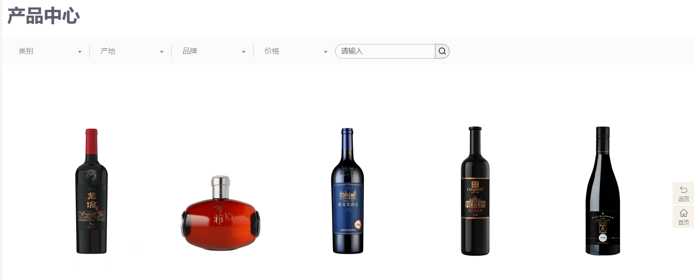

# 功能：

## 前台功能：

### 首页：

顶部导航栏从左到右显示首页，关于我们，租赁中心，新闻资讯，客服中心。

搜索图标（鼠标移入时弹出搜索框），

用户图标（未登录时点击进入登录页面；登陆后点击进入个人页面），

购物车图标（鼠标移入时弹出一小栏购物车【显示 “商品缩略图 + 产品名称 + 租赁规格（如 3 天 50 元 / 天）+ 数量 + 小计价格”，用户无需进入购物车详情，即可快速确认商品信息，减少操作步骤。】

未登录时也可以把物品加入购物车，登陆后把未登录中的购物车中的东西和账号已有的购物车中的东西合并，一小栏购物车下面有一个按钮名为“去购物车结算”，点击进入购物车详情页面）。

首页有三种样式的轮播图。点击图片时会根据图片的productId匹配产品的id，匹配到两者相等则跳转到对应的产品详情页面（如果没有匹配到则弹出信息‘未找到该商品’）

首页还有一个视频轮播组件和轮播图组件类似，只是图片换成了视频，且同样可以根据匹配id跳转到详情页面。

首页最下面是一个静态页脚组件。


### 关于我们：

最上面是一张图片显示关于我们。

中间及一下主要是用于介绍我们公司的静态页面。


### 租赁中心：

最上面是一张照片显示租赁中心。

下面是类似这样的：



可以根据产品类别【无人机，手持设备，微单相机，单反相机】和品牌【大疆，影石，索尼，佳能，尼康，富士】分页（每页20个产品）显示对应的产品，可以同时选择一个产品类别和品牌类别来查看产品卡片，如果用户的组合不存在，显示当前未找到您想要的产品，然后下面显示【热门推荐】组件，点击对应的产品可以进入产品详情页面，默认排序是根据首字母【A-Z】排序，右边有一个【按照评分排序】点击后产品按照评分从高到底排序。


### 产品详情页面：

左边是图片展示，每个产品拥有五张图片（正方形），右边从上到下显示

照片下面显示的是该产品的平均评分（会根据这个产品下面每条评论的打分来计算打分平均数）

产品名称（举例：尼康D850，大疆Osmo Action 5Pro），

产品特点简介(举例：全新 1/1.3 英寸传感器，旗舰影像 | 人物居中，锁定主角 | 双 OLED 高亮触摸屏 | 360° 地平线增稳，硬核防抖 | 大容量电池，4 小时超长续航 | 双 DJI 麦克直连，专业收音)，

产品品牌（举例：大疆，索尼，佳能，尼康，富士），

产品Id（举例：Nikon-D850，DJI-OsmoAction4），

租赁规格自己选择租赁日期【几天（3-180天）】（3-5天，一天50）（6-15天，一天40）（16-30，一天30）（31-180天，一天15），会直接把价格说明标注在旁边，每种产品租凭时间区间一样但是价格不一样（无人机：3-5天，一天200）

需要缴纳【押金 × 元（租完验收无误后退还）】

数量选择（不能为0和负数），旁边显示库存数量，选择的数量不能超过库存数，当某商品的库存数量为0的时候，该商品无法点击加入购物车。【管理员可以在后台页面修改库存数量】

加入购物车按钮，点击后会加入购物车。

下方还有商品的品牌详情介绍和产品详情介绍。

一个发表评论栏【打星（1-5），评论，上传照片（最多支持上传三张照片），点击发布按钮】

最下面是分页显示评论，评论包括【文字评论（50字上限）、评分(1-5 星)、评论时间、用户账号，点赞和点踩】，自己和其他用户都可以点赞或者点踩，只能点一方，如果已经点踩了，再去点赞就会取消点踩，评论默认按时间排序显示，第一页显示最新的评论。


### 新闻资讯：

最上面是一张照片显示新闻资讯。

下面是一块一块的新闻【块里面包含：图片，新闻标题，发布时间，修改时间，发布人】，分页显示，每页只显示9块新闻，按照发布时间排序，第一页显示最新的新闻。


### 新闻详情页面：

点击会进入新闻详情页面【从上到下：标题，发布时间，修改时间，发布人，正文（采用md文档转换成的，前端添加 “MD 图片自适应规则”：“MD 文档中的图片自动适配页面宽度（最大宽度 100%），点击图片可查看原图”，确保阅读流畅。），返回按钮（返回到显示一块一块新闻资讯的分页页面，位置会固定在页面右侧）】


### 客服中心：

最上面是一张照片显示客服中心。

中间是一个提出问题的模块，用户可以输入问题，选择问题的类型【租金问题，押金问题，下单问题，保险问题，售后问题，其他问题】，后台页面会接收到该问题，当管理员在后台填写这个问题的回答之后，这个问题就会显示到相关的问题模块里面。

用户提交问题后，需显示 “提交成功！管理员将在 24 小时内回复

下面是6块常见问题【租金问题，押金问题，下单问题，保险问题，售后问题，其他问题】，点击相关问题进入相关问题的详情页面。

### 问题详情页面：

进入后会有一条一条的块，里面包含问题和回答，分页显示，每页显示20条问题。【里面暗含了创建时间和修改时间，按照创建时间排列问题，最新的问题显示在第一页】，右边会在页面上固定一个返回按钮点击返回到上一个页面。


### 搜索页面：

在搜索栏输入信息可以经行对【产品名称】和【新闻标题】的模糊查找。

搜索显示的内容分为两类，产品块和新闻块，点击【产品】按钮和【新闻】按钮可以来查看搜索到的产品和新闻。

当用户搜索的关键词无法查到的时候，页面中显示【暂时未找到该关键词】，下面是一个【热门推荐】的组件


### 登陆注册：

#### 登录页面如下：

使用用户名或者电话进行登录

输入密码


#### 注册页面如下：

输入用户名

输入电话号

输入密码

确认密码


### 个人中心：

#### 个人信息及修改：

修改头像，修改用户名，修改真实姓名，修改手机号，修改支付宝账号，修改性别，修改生日，保存修改。


#### 修改密码：

输入当前密码

请输入新密码

再次输入新密码

按钮【修改密码】【重置】


#### 身份证上传功能：

上传身份证正面图片：上传到个人信息的idCardPhoto中并且可以在这个页面看见，提供 “重新上传” 按钮。

上传页面说明：身份证信息仅用于租赁身份验证，平台将加密存储，不会泄露给任何第三方；


#### 管理收货地址的功能：

收货地址【收货人，联系方式，收货地址，支付宝账号】，右边两个按钮【切换地址】，【添加地址】，切换地址的时候选择哪个，哪个就是默认地址。默认地址会显示在管理地址这个地方。

增加地址的时候注意：前端需强制校验 “收货人、手机号、地址、支付宝账号” 是否完整（如手机号格式错误、地址为空时，禁用 “提交订单” 按钮），避免订单信息无效


#### 订单列表：

分为【全部订单，待付款，待收货，待归还，已完成，已取消】

从左到右分别为：订单编号，

订购的产品名称（可能有好几个，换行排列），

每个产品后面显示数量，

订单总额，

订单状态【待付款，待收货，待归还，已完成，已取消】，

创建时间，

查看详情。

在订单详情页 / 订单列表（待归还状态）新增**超时前倒计时**，具体显示：

- 待归还状态初始：“待归还（需在租期结束后 3 天内提交归还单号，剩余 2 天 23 小时）”；
- 倒计时 <24 小时：文字变橙色，提示 “仅剩 23 小时需提交归还单号，超时将按 50 元 / 天扣押金”；
- 超时后：文字变红，标注 “已超时 1 天，已扣 50 元押金，仍需尽快提交归还单号”，让用户提前感知风险，减少纠纷。


#### 归还快递页面：

用于查看归还的快递是否被平台签收，主要显示如下：

之前的订单号，退货快递编号，平台是否签收，押金是否退回。


### 订单详情页面：

点击查看详情进入该订单的详情页面，从上到下：

订单状态【待付款，待收货，待归还，已完成，已取消】

收货地址【姓名，电话，地址，支付宝账号】，

订购的产品信息【产品名称，产品Id，租赁规格，租赁数量，该商品的租赁价格】，

总价格，

下单时间，

订单编号，

快递编号。

最下面有

继续付款（当订单状态是【待付款】时才能点击，点击后订单状态变成【待收货】）

取消按钮（当订单状态是【待付款】时才能点击，点击后订单状态变成【已取消】）

确认收货（当订单是【待收货】状态时才能点击，点击后订单状态变成【待归还】）

如果用户超时3天未提交归还快递单号，会从押金中按照每天扣除租金【如何判断？从创建订单的时候+自己选择的租期+三天，超过这个时间订单状态还是【待归还】状态则会把订单颜色变成红色后面会加上红色的超时】

在订单详情页 / 订单列表（待归还状态）新增**超时前倒计时**，具体显示：

- 待归还状态初始：“待归还（需在租期结束后 3 天内提交归还单号，剩余 2 天 23 小时）”；
- 倒计时 <24 小时：文字变橙色，提示 “仅剩 23 小时需提交归还单号，超时将按 50 元 / 天扣押金”；
- 超时后：文字变红，标注 “已超时 1 天，已扣 50 元押金，仍需尽快提交归还单号”，让用户提前感知风险，减少纠纷。
- 超时未提交归还单号，按您租赁时选择的租期梯度单价扣押金（例：您选 10 天租期，按 40 元 / 天扣）

归还按钮（当订单状态是【待归还】的时候点击，点击后弹出一个输入快递单号的输入框，用户需要输入退回快递的订单号，管理员会在后台操作，当收到用户寄回的快递时，由管理员来修改订单的状态为【已完成】）

给订单添加一个定时器，在【待付款 】状态保持超过10分钟自动变成【已取消】状态

当订单状态变成【已取消】的时候，减少的相关库存会再重新添加回去。

最下面添加说明：

- 验收标准：列出 “不影响押金退还” 的正常磨损（如轻微划痕）和 “需扣押金” 的损坏（如镜头碎裂、机身进水），附示例图；
- 退还时效：“收到归还商品并验收无误后，1-3 个工作日内退还押金至原支付账户”；
- 争议处理：“若对验收结果有异议，可在 24 小时内提交商品照片 / 视频，平台将在 48 小时内复核”。


### 购物车详情：

点击购物小栏上的【去购物车结算】按钮进入购物车详情页面。

从左到右显示：

勾选框【有是否全选的按钮】

商品信息【产品的第一张图片+产品名称】

租赁规格自己选择租赁日期【几天（3-180天）】（3-5天，一天50）（6-15天，一天40）（16-30，一天30）（31-180天，一天15）（可以点击切换租赁规格，同时价格也会改变，注意这一点）

数量，价格小计，操作【删除】

最下面是一个价格总计【共x件商品，已选择y件，商品合计多少钱】，只有勾选框选上的商品价格才会进入合计。

右边是一个【下单结算】按钮，点击进入创建订单页面。


### 创建订单页面：

最上面是收货地址【收货人，联系方式，收货地址，支付宝账号】，右边两个按钮【切换地址】，【添加地址】

增加地址的时候注意：前端需强制校验 “收货人、手机号、地址、支付宝账号” 是否完整（如手机号格式错误、地址为空时，禁用 “提交订单” 按钮），避免订单信息无效

默认【送货上门】

中间显示订单的商品信息：产品的第一张照片+产品名称，单价，数量，小计，实付，所有购买商品价格总计。

在「创建订单页」“商品信息汇总区” 补充：

- 押金明细：单独列出 “总押金：×× 元（含商品 A 500 元 + 商品 B 300 元）”，并标注 “租完验收无误后 1-3 个工作日退还”；
- 支付说明：“订单支付金额 = 租金总额 + 总押金，需一次性支付”，避免用户误解 “押金可后付”。

最下面是一个【提交订单】按钮，点击后成功创建订单并跳转到支付页面，此时订单状态为【待付款】（保持此状态10分钟自动变成【已取消】状态），成功创建订单后会根据订单中的产品的名称和数量去减少其相应的库存数量。


### 支付页面：

上面显示【订单提交成功！请尽快完成支付。还剩xx分钟xx秒，超时自动取消订单】右边显示需要支付的价格，

下面有两种支付平台，【微信支付】和【支付宝支付】，点击使该订单从【待支付】状态转变为【待收货】状态，页面跳转到用户个人页面下的订单列表。


## 大疆及相机租赁网站 - 后台管理系统功能设计

后台管理系统核心角色为**管理员**（对应 `users` 表 `role: "admin"`），功能设计需完全支撑前台业务数据管理，贴合 MongoDB 数据库结构，实现 “数据录入 - 状态流转 - 审核管控 - 统计分析” 全流程，具体模块如下：

### 后台登录与权限控制

#### 管理员登录（其实是公用了一套登录，登录的时候直接判断用户role来实现页面导向）

- **功能说明**：独立于前台用户的登录入口，仅允许 `role: "admin"` 的账号登录，验证账号密码安全性。
- 核心操作：
  - 输入 `username`（管理员账号）和 `password`（密码，与 `users` 表 `passwordHash` 匹配）；
  - 支持 “记住密码”（Cookie 存储 7 天）和 “忘记密码”（通过管理员绑定的 `phone` 发送验证码重置密码）；
  - 登录成功后生成 Token（有效期 2 小时），拦截未登录用户访问后台路由。
- **关联数据库**：`users`（`username`、`passwordHash`、`role`、`phone`）。

### 产品管理模块

#### 产品基础管理（CRUD）

- **功能说明**：管理前台租赁中心的所有产品数据，支撑前台 “分类 / 品牌筛选”“库存控制”“价格展示”。
- 核心操作：
  - 新增产品：
    - 填写产品基本信息（`name`、`productId`、`brand`、`category` 等，`brand`/`category` 下拉选择枚举值）；
    - 设置租赁价格梯度（`rentalPriceRules`，添加 4 个固定租期区间：3-5 天 / 6-15 天 / 16-30 天 / 31-180 天，填写对应 `pricePerDay`）；
    - 上传 5 张正方形主图（`mainPictures`，支持预览和排序）；
    - 填写 `featureDesc`（产品特点）、`brandDetail`（品牌介绍）、`productDetail`（产品详情，支持 MD 编辑器）。
  - **编辑产品**：修改上述所有信息，仅 `productId` 不可修改（避免关联轮播图 / 订单失效）。
  - **删除产品**：仅允许删除 “无关联订单 / 购物车” 的产品（防止数据引用错误），或支持 “逻辑删除”（新增 `isDeleted` 字段，前台不展示）。
  - **查看产品**：分页展示所有产品（每页 20 条，与前台租赁中心一致），支持按 `brand`/`category`/`stock` 状态（库存为 0 / 正常）筛选。
- **关联数据库**：`products`（所有字段）。

#### 产品库存与上下架

- **功能说明**：控制前台产品的 “可租赁状态” 和库存数量。
- 核心操作：
  - **库存修改**：直接编辑 `stock` 字段（支持批量修改，如 “批量增加 10 件库存”），修改后实时同步到前台（库存为 0 时前台 “加入购物车” 按钮禁用）；
  - **上下架控制**：新增 `isOnSale` 字段（默认 `true`），下架后前台租赁中心不展示该产品；
  - **库存预警**：设置库存阈值（如低于 5 件），后台列表中标红预警，提醒管理员补货。
- **关联数据库**：`products`（`stock`、新增 `isOnSale`）。

### 订单管理模块

#### 订单列表与筛选

- **功能说明**：查看前台所有用户的订单，支撑 “订单状态流转” 和 “异常订单处理”。
- 核心操作：
  - 分页展示所有订单（每页 20 条），默认按 `createTime` 倒序；
  - 多维度筛选：按 `status`（待付款 / 待收货等）、`orderNo`（订单号精确搜索）、`userId`（用户 ID 搜索）、`createTime` 区间（如近 7 天 / 近 30 天）；
  - 订单详情查看：展示 `addressInfo`、`orderItems`、`totalRental` 等所有字段，支持打印订单凭证。
- **关联数据库**：`orders`（所有字段）、`users`（通过 `userId` 关联查看用户名 / 手机号）。

#### 订单状态操作

- **功能说明**：处理前台订单的全流程状态变更，确保订单流转合规。
- 核心操作：
  - 待付款订单：
    - 手动取消订单（需选择取消原因，对应 `cancelReason`），取消后自动恢复 `products.stock`；
    - 查看 `timeoutCancelTime`，超时未支付的订单标红提示，系统自动触发取消（可手动提前触发）。
  - 待收货订单：
    - 填写 `expressNo`（发货快递单号），填写后前台订单状态更新为 “待收货”，用户可查看物流。
  - 待归还订单：
    - 确认签收：用户提交 `returnExpressNo` 后，管理员核对物流，标记 `isReceived: true`；
    - 验收处理：填写 `damageDesc`（如 “镜头碎裂”），计算 `deductionDeposit` 和 `deductionDetails`（如 “超时 2 天，每天扣 40 元”），扣减后剩余押金可手动标记 `isDepositRefunded: true`（前台显示 “押金已退还”）。
  - **已完成 / 已取消订单**：支持订单备注（如 “用户投诉处理完毕”），备注仅后台可见。
- **关联数据库**：`orders`（`status`、`expressNo`、`isReceived`、`damageDesc` 等）、`products`（`stock`，取消订单时恢复）。

#### 订单导出与统计

- **功能说明**：方便管理员进行订单数据统计和财务对账。
- 核心操作：
  - 导出订单：按筛选条件导出 Excel（包含 `orderNo`、`userId`、`status`、`totalPay`、`createTime` 等关键字段）；
  - 订单统计：展示今日 / 昨日 / 近 7 天的订单总量、交易额（`totalPay` 总和）、押金总额（`totalDeposit` 总和），支持按 `status` 统计占比（如待付款订单占比 10%）。
- **关联数据库**：`orders`（所有字段）。

### 用户管理模块

####  用户列表与筛选

- **功能说明**：管理前台所有注册用户，处理用户账号问题和身份审核。
- 核心操作：
  - 分页展示用户（每页 20 条），支持按 `role`（普通用户 / 管理员）、`status`（正常 / 禁用）、`username`/`phone`（模糊搜索）筛选；
  - 查看用户详情：展示 `realName`、`avatar`、`alipayAccount` 等信息，关联查看用户的 `addresses`（收货地址）、`orders`（历史订单）、`cart`（购物车）。
- **关联数据库**：`users`（所有字段）、`addresses`（`userId` 关联）、`orders`（`userId` 关联）。

#### 用户账号与身份审核

- **功能说明**：控制用户账号状态，审核用户身份证（支撑前台 “身份验证后租赁”）。
- 核心操作：
  - **账号状态修改**：将用户 `status` 改为 `disabled`（禁用账号，前台登录时提示 “账号已禁用”），需填写禁用原因（后台备注）；
  - 身份证审核：
    - 查看用户上传的 `idCardPhoto`（点击预览原图）；
    - 选择审核结果：`approved`（通过）、`rejected`（拒绝，需填写 `idCardAuditRemark`，如 “身份证信息不清晰”）；
    - 审核结果实时同步到前台（用户个人中心可查看审核状态）。
  - **密码重置**：用户忘记密码时，管理员可通过 `phone` 发送临时密码（前台登录后强制修改）。
- **关联数据库**：`users`（`status`、`idCardPhoto`、`idCardAuditStatus`、`idCardAuditRemark`、`phone`）。

### 评论管理模块

#### 评论列表与筛选

- **功能说明**：管理前台产品评论，维护评论区秩序（防止违规内容）。
- 核心操作：
  - 分页展示所有评论（每页 20 条），支持按 `productId`（产品 ID 搜索）、`score`（评分筛选，如 1 星 / 5 星）、`commentTime` 区间筛选；
  - 查看评论详情：展示 `commentPictures`（评论图片）、`likeCount`/`dislikeCount`，关联查看 `commentInteractions`（用户互动记录）。
- **关联数据库**：`productComments`（所有字段）、`commentInteractions`（`commentId` 关联）、`products`（`productId` 关联查看产品名称）。

#### 评论审核与操作

- **功能说明**：处理违规评论，确保前台评论质量。
- 核心操作：
  - **审核评论**：新增 `isAudited` 字段（默认 `true`，支持开启 “手动审核”，未审核评论前台不展示），拒绝审核需填写原因（后台备注）；
  - **删除评论**：删除违规评论（同时删除关联的 `commentInteractions`，避免数据冗余）；
  - **回复评论**：编辑 `adminReply` 字段（管理员回复，前台评论区显示 “管理员回复” 标识）。
- **关联数据库**：`productComments`（新增 `isAudited`、`adminReply`）、`commentInteractions`（`commentId` 关联删除）。

### 轮播图与轮播视频管理

#### 轮播图管理（banners）

- **功能说明**：控制前台首页图片轮播，支撑 “点击跳转产品详情”。

- 核心操作：

  - CRUD 轮播图：

    - 新增：上传

      ```
      imageUrl
      ```

      （轮播图），选择

      ```
      type
      ```

      （top/middle/bottom，对应前台位置）、

      ```
      linkType
      ```

      （product/url/none）；

      - 若 `linkType=product`：下拉选择 `productId`（关联 `products.productId`，避免手动输入错误）；
      - 若 `linkType=url`：填写 `linkUrl`（外部活动链接）；

    - 编辑：修改上述信息，调整 `sortOrder`（排序序号，数字越小越靠前）；

    - 删除：仅允许删除 `isActive: false`（未启用）的轮播图；

  - **状态控制**：切换 `isActive`（启用 / 禁用，禁用后前台不展示）；

  - **生效时间**：设置 `startTime`/`endTime`（自动启用 / 禁用，如活动期间展示）。

- **关联数据库**：`banners`（所有字段）、`products`（`productId` 关联选择）。

#### 轮播视频管理（bannerVideos）

- **功能说明**：控制前台首页视频轮播，确保视频正常展示（无跳转）。
- 核心操作：
  - CRUD 轮播视频：
    - 新增：上传 `videoUrl`（MP4 格式）和 `videoCoverUrl`（封面图），填写 `duration`（视频时长，自动读取或手动输入），选择 `type`（top/middle/bottom）；
    - 编辑：调整 `sortOrder`、`autoPlay`/`loop`/`muted`（播放设置，默认 true/true/true）；
    - 删除：同轮播图，仅删除未启用视频；
  - **状态控制**：切换 `isActive`，预览视频播放效果（后台内置视频播放器）。
- **关联数据库**：`bannerVideos`（所有字段）。

### 新闻管理模块

#### 新闻基础管理（CRUD）

- **功能说明**：管理前台新闻资讯，支撑 “新闻列表” 和 “新闻详情”。
- 核心操作：
  - 新增新闻：
    - 填写 `newsTitle`（标题）、`newsCategory`（分类：新品公告 / 促销活动 / 行业资讯 / 通知，对应 `news` 表新增字段）；
    - 上传 `newsCover`（封面图），选择 `publisher`（默认当前管理员账号）；
    - 用 MD 编辑器编写 `content`（正文，支持图片上传，自动适配前台 “图片自适应规则”）；
  - **编辑新闻**：修改上述信息，`publishTime` 可手动调整（默认自动生成）；
  - **删除新闻**：删除后前台新闻列表和搜索结果中不再展示；
  - **查看新闻**：分页展示（每页 20 条），按 `publishTime` 倒序，支持按 `newsCategory`/`newsTitle`（模糊搜索）筛选。
- **关联数据库**：`news`（所有字段，新增 `newsCategory`）。

#### 新闻预览与阅读量

- **功能说明**：确保新闻在前台展示正常，统计新闻热度。
- 核心操作：
  - **预览新闻**：点击 “预览” 按钮，打开前台新闻详情页（仅管理员可见），检查格式和图片；
  - **阅读量统计**：展示 `viewCount`（阅读量），支持手动校正（如排除管理员预览的点击量）。
- **关联数据库**：`news`（`viewCount`、`content`）。

### 客服问题管理模块

#### 问题列表与筛选

- **功能说明**：处理前台用户提交的客服问题，支撑 “24 小时内回复” 承诺。
- 核心操作：
  - 分页展示所有问题（每页 20 条），按 `submitTime` 倒序；
  - 多维度筛选：按 `questionType`（租金问题 / 押金问题等）、`isReplied`（是否回复）、`userId`（用户 ID 搜索）；
  - 查看问题详情：展示 `questionContent`（用户问题）、`submitTime`，关联查看用户信息（`users.username`/`phone`）。
- **关联数据库**：`customerQuestions`（所有字段）、`users`（`userId` 关联）。

#### 问题回复与管理

- **功能说明**：回复用户问题，整理常见问题（支撑前台 “常见问题分类查看”）。
- 核心操作：
  - **回复问题**：编辑 `replyContent`（回复内容），选择 `adminId`（当前管理员账号），点击 “提交” 后自动更新 `replyTime` 和 `isReplied: true`，回复实时同步到前台；
  - **批量操作**：批量标记 “已回复”（针对重复问题）、批量删除无效问题（如垃圾广告）；
  - **常见问题置顶**：新增 `isTop` 字段（默认 `false`），置顶的问题在前台对应分类下优先展示。
- **关联数据库**：`customerQuestions`（`replyContent`、`replyTime`、`adminId`、`isReplied`、新增 `isTop`）。

### 数据统计与系统设置

#### 核心数据统计

- **功能说明**：展示网站运营核心数据，帮助管理员决策。
- 核心指标：
  - **产品数据**：总产品数、上架产品数、库存预警产品数、各 `category` 产品占比；
  - **订单数据**：今日 / 昨日 / 近 30 天订单量、交易额、押金总额、各 `status` 订单占比；
  - **用户数据**：总注册用户数、今日新增用户数、身份审核通过用户数、活跃用户数（近 7 天有订单 / 购物车操作）；
  - **流量数据**：今日新闻总阅读量、产品详情页总浏览量、轮播图 / 视频总点击量。
- **展示形式**：折线图（趋势变化，如近 30 天订单量）、饼图（占比，如各品类产品占比）、数字卡片（实时数据），支持数据导出（Excel）。
- **关联数据库**：所有核心集合（`products`、`orders`、`users`、`news`、`banners` 等）的统计查询。

#### 系统设置

- **功能说明**：配置网站基础参数，管理管理员权限。
- 核心操作：
  - **管理员账号管理**：新增管理员（`role: "admin"`，设置 `username`/`password`/`phone`）、修改管理员密码、删除管理员（保留至少 1 个超级管理员）；
  - **权限分配**：细分管理员角色（如 “产品管理员” 仅能操作产品模块，“订单管理员” 仅能操作订单模块），对应后台路由权限拦截；
  - 基础参数配置：
    - 订单超时时间（`timeoutCancelTime`，默认 10 分钟，可修改）；
    - 押金退还时效（前台显示的 “1-3 个工作日”，可调整并同步到前台说明）；
    - 购物车合并规则（如 “未登录购物车与登录后合并时，数量取最大值”）；
  - **文件存储配置**：设置图片 / 视频上传路径（如 `/uploads/products/`）、文件大小限制（如产品图片≤5MB，视频≤100MB）。
- **关联数据库**：`users`（`role: "admin"`）、`orders`（`timeoutCancelTime`）。

### 通用功能（所有模块共用）

1. **面包屑导航**：显示当前操作路径（如 “后台首页> 订单管理 > 待收货订单”），支持快速返回上级页面；
2. **操作日志**：记录管理员的关键操作（如 “修改产品库存”“回复客服问题”），包含操作人、操作时间、操作内容、IP 地址，支持按时间 / 操作人筛选查询；
3. **数据分页**：所有列表页默认分页（每页 20 条，与前台一致），支持自定义每页条数（10/20/50 条）；
4. **批量操作**：支持批量选择数据（如批量删除产品、批量回复问题），提高管理效率；
5. **提示反馈**：操作成功 / 失败时弹出提示（如 “订单取消成功”“图片上传失败，请检查格式”），避免误操作。

### 后台功能与前台 / 数据库的适配性说明

1. **数据一致性**：所有后台操作直接映射到 MongoDB 字段（如修改订单 `expressNo` 对应 `orders.expressNo`，审核身份证对应 `users.idCardAuditStatus`），确保前台展示的数据与后台操作一致；
2. **业务闭环**：前台的每一个功能都有后台支撑（如前台 “身份证上传” 对应后台 “身份审核”，前台 “订单超时取消” 对应后台 “超时订单管理”），无业务断点；
3. **权限控制**：仅 `role: "admin"` 的用户可进入后台，细分权限避免误操作（如普通管理员不能删除超级管理员），符合数据安全要求。


# 大疆及相机租赁网站 - MongoDB 数据库设计

基于网站功能需求，设计以下核心 MongoDB 集合（Collection），覆盖产品、用户、订单、评论、新闻、客服问题、收货地址等核心业务模块，每个集合包含字段定义、类型、描述及示例，确保贴合前台交互与后台管理需求。

## 1. 产品集合（`products`）

### 描述

存储所有租赁产品的核心信息，支持租赁中心筛选（类别 / 品牌）、产品详情展示、库存管理等功能。

### 字段结构

| 字段名             | 类型          | 描述                                                         | 示例                                                         |
| ------------------ | ------------- | ------------------------------------------------------------ | ------------------------------------------------------------ |
| `_id`              | ObjectId      | 产品唯一 ID（MongoDB 自动生成）                              | `ObjectId("60d21b4667d0d8992e610c85")`                       |
| `productId`        | String        | 业务产品 ID（自定义，如品牌 - 型号），用于轮播图跳转匹配     | `"DJI-OsmoAction5Pro"`, `"Nikon-D850"`                       |
| `name`             | String        | 产品名称                                                     | `"大疆Osmo Action 5Pro"`, `"尼康D850 全画幅单反"`            |
| `brand`            | String        | 产品品牌（支持筛选），枚举：`["大疆","影石","索尼","佳能","尼康","富士"]` | `"大疆"`, `"尼康"`                                           |
| `category`         | String        | 产品类别（支持筛选），枚举：`["无人机","手持设备","微单相机","单反相机"]` | `"手持设备"`, `"单反相机"`                                   |
| `score`            | Number        | 产品平均评分（由评论评分计算得出，保留 1 位小数）            | `4.8`（基于 20 条评论计算）                                  |
| `stock`            | Number        | 产品库存数量（管理员可修改，库存为 0 时无法加入购物车）      | `50`                                                         |
| `deposit`          | Number        | 租赁押金（单位：元，租后验收无误退还）                       | `2000`（大疆无人机押金）, `1500`（尼康 D850 押金）           |
| `rentalPriceRules` | Array<Obj>    | 租赁价格梯度（不同租期对应不同日租价，所有产品租期区间统一，单价不同） | `[{"minDay":3,"maxDay":5,"pricePerDay":200},{"minDay":6,"maxDay":15,"pricePerDay":180}]` |
| `mainPictures`     | Array<String> | 产品主图（5 张正方形，产品详情左侧展示）                     | `["https://xxx/dji-action5-1.jpg","https://xxx/dji-action5-2.jpg"]` |
| `featureDesc`      | String        | 产品特点简介（产品详情页展示）                               | `"全新1/1.3英寸传感器，旗舰影像｜360°地平线增稳｜4小时续航"` |
| `brandDetail`      | String        | 品牌详情介绍（产品详情页下方）                               | `"大疆创新是全球领先的无人飞行器控制系统及无人机解决方案研发和生产商..."` |
| `productDetail`    | String        | 产品详情介绍（产品详情页下方，支持 MD 格式）                 | `"尼康D850搭载4575万像素全画幅CMOS传感器，ISO范围100-12800..."` |
| `sortLetter`       | String        | 首字母（用于默认排序 A-Z）                                   | `"D"`（大疆）, `"N"`（尼康）                                 |
| `createTime`       | Date          | 产品创建时间（后台添加）                                     | `ISODate("2024-01-15T08:30:00Z")`                            |
| `updateTime`       | Date          | 产品更新时间（后台修改库存 / 价格时更新）                    | `ISODate("2024-05-20T14:20:00Z")`                            |

## 用户集合（`users`）

### 表说明

存储用户账号信息、个人资料、购物车数据、地址关联等，支持登录注册、个人中心管理、购物车合并、订单地址默认选择等功能。

| 字段名             | 数据类型      | 是否必填 | 描述                                                         | 示例值                                                       |
| ------------------ | ------------- | -------- | ------------------------------------------------------------ | ------------------------------------------------------------ |
| `_id`              | ObjectId      | 是       | MongoDB 自动生成的唯一用户 ID，作为表主键                    | `ObjectId("68bd236e379a3627caeb01ee")`                       |
| `username`         | String        | 是       | 用户登录账号                                                 | `"zhangsan1"`、`"user123@example.com"`                       |
| `passwordHash`     | String        | 是       | 加密后的密码哈希（如 bcrypt 算法，不存储明文密码，保障安全） | `"$2b$10$/j0EPVgZOYkE1jKjm1NVWuzXHQtBy2yQDtGrljUSREtRL9qf5ALdC"` |
| `realName`         | String        | 是       | 用户真实姓名（用于身份证验证、租赁身份审核）                 | `"张三1"`                                                    |
| `phone`            | String        | 是       | 用户手机号（唯一，11 位数字，用于登录、验证码接收）          | `"19186400279"`                                              |
| `avatar`           | String        | 否       | 用户头像图片 URL（默认可设为占位图，支持个人中心修改）       | `"/uploads/avatars/avatar_68bd236e379a3627caeb01ee_1757230121706.jpg"` |
| `gender`           | String        | 否       | 用户性别（枚举：`["male","female","unknown]`，默认可空）     | `"male"`                                                     |
| `birthday`         | String        | 否       | 用户生日（格式：`YYYY-MM-DD`，可选填写）                     | `"2025-09-01"`                                               |
| `idCardPhoto`      | String        | 否       | 身份证正面图片 URL（用户上传，用于租赁身份验证，默认空字符串） | `"/uploads/idcards/zhangsan1_idcard.jpg"`（填写后）、`""`（未上传） |
| `alipayAccount`    | String        | 是       | 支付宝账号（用于押金退还，创建订单时强制校验，不可为空）     | `"nb666@zhifubao.com"`                                       |
| `sesameCredit`     | Number        | 否       | 芝麻信用分（可选，可用于押金减免逻辑，默认null）             | `null`                                                       |
| `status`           | String        | 是       | 用户账号状态（枚举：`["normal","disabled"]`，默认`normal`）  | `"normal"`（正常）、`"disabled"`（禁用）                     |
| `role`             | String        | 是       | 用户角色（枚举：`["user","admin"]`，默认`user`，区分普通用户 / 管理员） | `"user"`（普通用户）、`"admin"`（管理员，用于后台操作）      |
| `cart`             | Array<Object> | 是       | 购物车数据（未登录时本地存储，登录后合并，默认空数组）       | [   {     "productId": "DJI-OsmoAction5Pro",  // 关联产品ID（必要）     "productName": "大疆Osmo Action5Pro",  // 商品名称快照（推荐）     "mainPicture": "https://xxx/dji-action5-1.jpg",  // 主图快照（推荐）     "rentalRule": {  // 租赁价格规则（原字段保留）       "minDay": 3,       "maxDay": 5,       "pricePerDay": 200     },     "rentalDays": 5,  // 实际选择的租赁天数（新增必要）     "quantity": 1,  // 数量（原字段保留，已满足需求）     "deposit": 2000,  // 押金快照（新增必要）     "selected": true,  // 是否勾选（新增必要）     "addTime": "ISODate("2025-09-10T08:00:00Z")"  // 添加时间（原字段保留）   } ] |
| `defaultAddressId` | ObjectId      | 否       | 关联默认收货地址 ID（关联`addresses`表，默认`null`，登录后可设置） | `ObjectId("68bd236e379a3627caeb01ef")`（关联地址 ID）、`null`（未设置） |
| `createdAt`        | Date          | 是       | 用户账号创建时间（自动生成，如注册时间）                     | `ISODate("2025-09-07T06:17:18.421+00:00")`                   |
| `updatedAt`        | Date          | 是       | 用户信息最后更新时间（如修改密码、上传头像时自动更新）       | `ISODate("2025-09-07T07:28:41.709+00:00")`                   |
| `__v`              | Number        | 是       | MongoDB 版本号字段（自动维护，用于乐观锁）                   | `0`                                                          |

## 收货地址集合（`addresses`）

### 描述

存储用户的收货地址，支持个人中心 “添加 / 切换 / 管理地址”，创建订单时校验地址完整性。

### 字段结构

| 字段名       | 类型     | 描述                                                | 示例                                          |
| ------------ | -------- | --------------------------------------------------- | --------------------------------------------- |
| `_id`        | ObjectId | 地址唯一 ID                                         | `ObjectId("60d21d4667d0d8992e610c87")`        |
| `userId`     | ObjectId | 关联用户 ID（关联`users`集合）                      | `ObjectId("60d21c4667d0d8992e610c86")`        |
| `receiver`   | String   | 收货人姓名（创建订单时必选）                        | `"张三"`                                      |
| `phone`      | String   | 收货人手机号（格式校验：11 位数字）                 | `"13800138000"`                               |
| `address`    | String   | 详细收货地址（省 + 市 + 区 + 街道，创建订单时必选） | `"北京市朝阳区建国路88号SOHO现代城A座1001室"` |
| `isDefault`  | Boolean  | 是否默认地址（用户切换地址时更新）                  | `true`                                        |
| `createTime` | Date     | 地址创建时间                                        | `ISODate("2024-04-05T16:20:00Z")`             |
| `updateTime` | Date     | 地址更新时间                                        | `ISODate("2024-05-20T15:10:00Z")`             |

##  订单集合（`orders`）

### 描述

存储用户租赁订单信息，支持订单状态流转（待付款→待收货→待归还→已完成 / 已取消）、超时逻辑、押金扣除等功能。

### 字段结构

| 字段名              | 类型       | 描述                                                         | 示例                                                         |
| ------------------- | ---------- | ------------------------------------------------------------ | ------------------------------------------------------------ |
| `_id`               | ObjectId   | 订单唯一 ID                                                  | `ObjectId("60d21e4667d0d8992e610c88")`                       |
| `orderNo`           | String     | 业务订单编号（自定义，如 “ORD20240522001”）                  | `"ORD20240522001"`                                           |
| `userId`            | ObjectId   | 关联用户 ID（关联`users`集合）                               | `ObjectId("60d21c4667d0d8992e610c86")`                       |
| `status`            | String     | 订单状态，枚举：`["待付款","待收货","待归还","已完成","已取消"]` | `"待归还"`                                                   |
| `addressInfo`       | Object     | 订单收货地址（创建订单时快照，避免地址修改影响订单）         | `{"receiver":"张三","phone":"13800138000","address":"北京市朝阳区...","alipayAccount":"zhangsan@alipay.com"}` |
| `orderItems`        | Array<Obj> | 订单商品列表（包含产品快照、租赁规格）                       | `[{"productId":"DJI-OsmoAction5Pro","productName":"大疆Osmo Action5Pro","rentalRule":{"minDay":3,"maxDay":5,"pricePerDay":200},"quantity":1,"subtotal":600,"deposit":2000}]` |
| `totalRental`       | Number     | 总租金（所有商品小计之和，单位：元）                         | `600`（3 天 ×200 元 / 天）                                   |
| `totalDeposit`      | Number     | 总押金（所有商品押金之和，单位：元）                         | `2000`                                                       |
| `totalPay`          | Number     | 总支付金额（总租金 + 总押金，单位：元）                      | `2600`                                                       |
| `expressNo`         | String     | 发货快递编号（管理员填写，待收货状态时补充）                 | `"SF1234567890123"`                                          |
| `returnExpressNo`   | String     | 归还快递编号（用户填写，待归还状态时补充）                   | `"YT9876543210987"`                                          |
| `isReceived`        | Boolean    | 平台是否签收归还商品（管理员操作，默认`false`）              | `false`                                                      |
| `isDepositRefunded` | Boolean    | 押金是否退还（管理员操作，默认`false`）                      | `false`                                                      |
| `timeoutCancelTime` | Date       | 待付款状态超时取消时间（创建订单后 10 分钟）                 | `ISODate("2024-05-22T10:30:00Z")`（10:20 创建，10:30 超时）  |
| `rentalEndTime`     | Date       | 租赁结束时间（创建订单时间 + 租赁天数）                      | `ISODate("2024-05-25T10:20:00Z")`（3 天租期，5.22→5.25）     |
| `returnDeadline`    | Date       | 归还截止时间（租赁结束时间 + 3 天）                          | `ISODate("2024-05-28T10:20:00Z")`                            |
| `overtimeDays`      | Number     | 待归还超时天数（超过`returnDeadline`后计算，默认 0）         | `1`（超时 1 天）                                             |
| `deductionDeposit`  | Number     | 超时扣除押金金额（超时天数 × 对应租期单价，单位：元）        | `200`（1 天 ×200 元 / 天）                                   |
| `payMethod`         | String     | 支付方式，枚举：`["wechat","alipay"]`，创建订单时必传。      | `"alipay"`                                                   |
| `cancelReason`      | String     | 取消原因，枚举：`["timeout","userCancel","systemError"]`，默认 `null`。 | `"timeout"`                                                  |
| `damageDesc`        | String     | 归还验收损坏详情（如 “镜头边缘划痕”），默认 `null`。         | `"镜头碎裂，需扣500元"`                                      |
| `createTime`        | Date       | 订单创建时间                                                 | `ISODate("2024-05-22T10:20:00Z")`                            |
| `updateTime`        | Date       | 订单状态更新时间                                             | `ISODate("2024-05-25T11:00:00Z")`（更新为待归还状态）        |

## 产品评论集合（`productComments`）

### 描述

存储用户对产品的评论，支持产品详情页 “发表评论”“分页查看评论”“点赞 / 点踩” 功能。

### 字段结构

| 字段名            | 类型          | 描述                                          | 示例                                                      |
| ----------------- | ------------- | --------------------------------------------- | --------------------------------------------------------- |
| `_id`             | ObjectId      | 评论唯一 ID                                   | `ObjectId("60d21f4667d0d8992e610c89")`                    |
| `productId`       | String        | 关联产品业务 ID（关联`products`集合）         | `"DJI-OsmoAction5Pro"`                                    |
| `userId`          | ObjectId      | 关联用户 ID（关联`users`集合）                | `ObjectId("60d21c4667d0d8992e610c86")`                    |
| `username`        | String        | 评论用户账号                                  | `"zhangsan1"`                                             |
| `score`           | Number        | 评分（1-5 星）                                | `5`                                                       |
| `content`         | String        | 评论内容（50 字上限）                         | `"设备很新，防抖效果超预期，续航足够一天使用！"`          |
| `commentPictures` | Array<String> | 评论图片（最多 3 张，可选）                   | `["https://xxx/comment1.jpg","https://xxx/comment2.jpg"]` |
| `likeCount`       | Number        | 点赞数（默认 0）                              | `20`                                                      |
| `dislikeCount`    | Number        | 点踩数（默认 0）                              | `2`                                                       |
| `commentTime`     | Date          | 评论发布时间                                  | `ISODate("2024-05-23T09:15:00Z")`                         |
| `updateTime`      | Date          | 评论更新时间（如修改内容 / 管理员回复，可选） | `ISODate("2024-05-23T10:00:00Z")`                         |

##   评论互动集合（`commentInteractions`）

替代 `productComments` 中的 `userAction`，解决数据冗余问题：

| 字段名       | 类型     | 描述                                    | 示例值                                 |
| ------------ | -------- | --------------------------------------- | -------------------------------------- |
| `_id`        | ObjectId | 互动唯一 ID。                           | `ObjectId("68bf12a3cd56789012345679")` |
| `commentId`  | ObjectId | 关联评论 ID（关联 `productComments`）。 | `ObjectId("60d21f4667d0d8992e610c89")` |
| `userId`     | ObjectId | 关联用户 ID（关联 `users`）。           | `ObjectId("60d21c4667d0d8992e610c86")` |
| `action`     | String   | 互动类型，枚举：`["like","dislike"]`。  | `"like"`                               |
| `createTime` | Date     | 互动时间。                              | `ISODate("2025-09-10T09:00:00Z")`      |


##  新闻集合（`news`）

### 描述

存储网站新闻资讯，支持新闻列表分页、新闻详情（MD 格式图片自适应）、按发布时间排序。

### 字段结构

| 字段名        | 类型     | 描述                                      | 示例                                                         |
| ------------- | -------- | ----------------------------------------- | ------------------------------------------------------------ |
| `_id`         | ObjectId | 新闻唯一 ID                               | `ObjectId("60d2204667d0d8992e610c90")`                       |
| `newsTitle`   | String   | 新闻标题（支持搜索模糊匹配）              | `"大疆发布新款Osmo Action 5Pro，防抖性能升级"`               |
| `newsCover`   | String   | 新闻封面图片（列表页展示）                | `"https://xxx/news-cover-dji.jpg"`                           |
| `publisher`   | String   | 发布人（如 “管理员”）                     | `"管理员"`                                                   |
| `publishTime` | Date     | 发布时间（列表页 / 详情页展示，按此排序） | `ISODate("2024-05-20T10:00:00Z")`                            |
| `updateTime`  | Date     | 修改时间（详情页展示，可选）              | `ISODate("2024-05-20T11:30:00Z")`                            |
| `content`     | String   | 新闻正文（MD 格式，前端适配图片自适应）   | `"### 大疆Osmo Action 5Pro核心升级\n1. 传感器升级：1/1.3英寸CMOS...\n"` |
| `viewCount`   | Number   | 阅读量（默认 0，用户查看详情时递增）      | `1200`                                                       |

##  客服问题集合（`customerQuestions`）

### 描述

存储用户提交的客服问题及管理员回复，支持 “提交问题”“常见问题分类查看”“分页展示”。

### 字段结构

| 字段名            | 类型     | 描述                                                         | 示例                                                         |
| ----------------- | -------- | ------------------------------------------------------------ | ------------------------------------------------------------ |
| `_id`             | ObjectId | 问题唯一 ID                                                  | `ObjectId("60d2214667d0d8992e610c91")`                       |
| `userId`          | ObjectId | 关联用户 ID（关联`users`集合，匿名用户可为`null`）           | `ObjectId("60d21c4667d0d8992e610c86")`                       |
| `questionType`    | String   | 问题类型，枚举：`["租金问题","押金问题","下单问题","保险问题","售后问题","其他问题"]` | `"押金问题"`                                                 |
| `questionContent` | String   | 问题内容                                                     | `"租赁大疆无人机的押金何时退还？验收后多久到账？"`           |
| `submitTime`      | Date     | 提交时间（按此排序，详情页展示）                             | `ISODate("2024-05-21T14:20:00Z")`                            |
| `replyContent`    | String   | 管理员回复内容（默认`null`，回复后补充）                     | `"验收无误后1-3个工作日内退还至您的支付宝账号，请注意查收。"` |
| `replyTime`       | Date     | 回复时间（默认`null`，回复后补充）                           | `ISODate("2024-05-21T16:00:00Z")`                            |
| `adminId`         | String   | 回复管理员 ID（默认`null`，如 “admin01”）                    | `"admin01"`                                                  |
| `isReplied`       | Boolean  | 是否已回复（用于筛选 “已解决 / 未解决” 问题，默认`false`）   | `true`                                                       |


## 完整轮播视频图表（`bannerVideos`）

### 表说明

存储网站轮播视频数据，仅用于视频展示（无跳转功能），支持按顺序播放、自动播放控制等特性，适合首页视频轮播组件。

| 字段名          | 数据类型 | 是否必填 | 描述                                                         | 示例值                                                       |
| --------------- | -------- | -------- | ------------------------------------------------------------ | ------------------------------------------------------------ |
| `_id`           | ObjectId | 是       | MongoDB 自动生成的唯一视频轮播 ID，作为表主键                | `ObjectId("68bf12a3cd56789012345678")`                       |
| `name`          | String   | 是       | 视频轮播名称（用于后台管理识别，如 “首页视频轮播 - 大疆飞行演示”） | `"大疆无人机飞行展示视频"`、`"影石全景相机宣传视频"`         |
| `description`   | String   | 否       | 视频描述（后台管理备注，前端可不展示）                       | `"2025大疆新品无人机户外飞行实拍"`                           |
| `videoUrl`      | String   | 是       | 视频资源 URL（支持 MP4 等格式，前端轮播播放的核心资源）      | `"/uploads/videos/dji-flight-demo.mp4"`、`"https://xxx/insta360-promo.mp4"` |
| `videoCoverUrl` | String   | 是       | 视频封面图 URL（视频未播放时显示的封面，建议与视频比例一致） | `"/uploads/videos/covers/dji-cover.jpg"`                     |
| `duration`      | Number   | 否       | 视频时长（单位：秒，用于前端显示时长，可选）                 | `60`（1 分钟视频）                                           |
| `isActive`      | Boolean  | 是       | 视频是否启用（`true`= 展示，`false`= 隐藏，默认`true`）      | `true`                                                       |
| `type`          | String   | 是       | 视频轮播位置（枚举：`["top","middle","bottom"]`，同图片轮播位置） | `"middle"`（首页中部视频轮播）                               |
| `sortOrder`     | Number   | 是       | 排序序号（数字越小越靠前，默认`0`，控制轮播顺序）            | `0`（第一个播放）、`1`（第二个播放）                         |
| `autoPlay`      | Boolean  | 是       | 是否自动播放（默认`true`，适合轮播场景）                     | `true`                                                       |
| `loop`          | Boolean  | 是       | 是否循环播放（默认`true`，轮播结束后重新开始）               | `true`                                                       |
| `muted`         | Boolean  | 是       | 是否静音播放（默认`true`，避免自动播放时突然发声）           | `true`                                                       |
| `createdAt`     | Date     | 是       | 视频创建时间（自动生成）                                     | `ISODate("2025-09-10T08:30:00.000+00:00")`                   |
| `updatedAt`     | Date     | 是       | 视频更新时间（如修改封面、调整排序时更新）                   | `ISODate("2025-09-10T09:15:00.000+00:00")`                   |
| `__v`           | Number   | 是       | MongoDB 版本号字段（自动维护）                               | `0`                                                          |

## 完整轮播图表（`banners`）

### 表说明

存储网站轮播图数据，支持首页轮播展示、按顺序排序、多场景跳转（产品详情 / 活动页面）、启用 / 禁用控制等功能。

| 字段名        | 数据类型 | 是否必填 | 描述                                                         | 示例值                                                       |
| ------------- | -------- | -------- | ------------------------------------------------------------ | ------------------------------------------------------------ |
| `_id`         | ObjectId | 是       | MongoDB 自动生成的唯一轮播图 ID，作为表主键                  | `ObjectId("68be49c1bf4200c03009ff61")`                       |
| `productId`   | String   | 否       | 关联产品业务 ID（仅当`linkType="product"`时必填，用于跳转产品详情） | `"uid1"`（关联产品 ID）、`""`（非产品跳转时为空）            |
| `name`        | String   | 是       | 轮播图名称（用于后台管理识别，如 “首页顶部轮播 - 大疆 Action5”） | `"轮播图名称1"`、`"首页顶部-大疆无人机促销"`                 |
| `description` | String   | 否       | 轮播图描述（后台管理备注，前端可不展示）                     | `"轮播图描述1"`、`"2025年9月大疆新品租赁活动"`               |
| `imageUrl`    | String   | 是       | 轮播图图片 URL（前端展示的轮播图资源，需确保可访问）         | `"/uploads/products/top/banner_top1.jpg"`、`"https://xxx/banner-dji.jpg"` |
| `isActive`    | Boolean  | 是       | 轮播图是否启用（`true`= 展示，`false`= 隐藏，默认`true`）    | `true`（启用）、`false`（临时隐藏）                          |
| `type`        | String   | 是       | 轮播图位置类型（枚举：`["top","middle","bottom"]`，区分首页不同位置） | `"top"`（首页顶部轮播）、`"middle"`（首页中部轮播）          |
| `sortOrder`   | Number   | 是       | 轮播图排序序号（数字越小越靠前，默认`0`，支持后台调整顺序）  | `1`（第 2 个展示）、`0`（第 1 个展示）、`2`（第 3 个展示）   |
| `linkType`    | String   | 是       | 轮播图跳转类型（枚举：`["product","url","none"]`，默认`"product"`） | `"product"`（跳产品详情）、`"url"`（跳外部链接）、`"none"`（不跳转） |
| `linkUrl`     | String   | 否       | 非产品跳转链接（仅当`linkType="url"`时必填，如活动页面 URL） | `"https://xxx/dji-promotion-2025"`（活动链接）、`""`（非 URL 跳转时为空） |
| `createdAt`   | Date     | 是       | 轮播图创建时间（自动生成，如后台添加时间）                   | `ISODate("2025-09-08T03:13:05.957+00:00")`                   |
| `updatedAt`   | Date     | 是       | 轮播图最后更新时间（如修改图片、调整排序时自动更新）         | `ISODate("2025-09-08T03:13:05.957+00:00")`                   |
| `__v`         | Number   | 是       | MongoDB 版本号字段（自动维护，用于乐观锁）                   | `1`                                                          |


## 集合关联关系说明

1. **用户 - 地址**：`users.defaultAddressId` → `addresses._id`，1 个用户可对应多个地址，1 个地址仅属于 1 个用户。
2. **用户 - 订单**：`orders.userId` → `users._id`，1 个用户可对应多个订单，1 个订单仅属于 1 个用户。
3. **用户 - 购物车**：`users.cart.productId` → `products.productId`，购物车与产品关联，存储租赁规格快照。
4. **产品 - 评论**：`productComments.productId` → `products.productId`，1 个产品可对应多个评论，1 个评论仅属于 1 个产品。
5. **用户 - 客服问题**：`customerQuestions.userId` → `users._id`，1 个用户可提交多个问题，1 个问题仅属于 1 个用户。

## 核心业务逻辑映射

1. **购物车合并**：用户登录时，将本地存储的`cart`数据与`users.cart`合并（按`productId`去重，保留数量较大值）。

2. **订单库存扣减**：创建订单（状态 “待付款”）时，按`orderItems`中产品数量扣减`products.stock`；订单取消（“已取消”）时，恢复对应库存。

3. 订单超时逻辑

   ：

   - 待付款：超过`timeoutCancelTime`自动更新状态为 “已取消”，恢复库存。
   - 待归还：超过`returnDeadline`后，每日递增`overtimeDays`，计算`deductionDeposit`，管理员确认后从押金中扣除。

4. **评论评分计算**：新增 / 修改评论时，重新计算对应产品的`products.score`（所有评论`score`的平均值）。

5. 搜索功能

   ：

   - 产品搜索：模糊匹配`products.name`。
   - 新闻搜索：模糊匹配`news.newsTitle`。


# API接口


# 前端

### 目录解析


# 后端

### 目录解析


# 优化点：

## 适配移动端框架，小屏显示


# 遇见的问题

##  “**唯一标识存储**”“**切断跨源通道**”“**后端校验隔离**”

我先运行5173端口这个项目登录产生一个token存储在5173，后来我又运行另一个项目在端口5174，为什么这个项目会自动获取5173端口的token然后自动变成登录状态，而且数据也全部传过来，我清除5174的本地缓存之后，重新启动之后就没有了，两个网站的cookie都为空。我清除5174的本地缓存之后重新启动项目之后就没有了，需要自己登录。解释上面事情发生的原理，以及告诉我怎么避免我从github git clone这个项目启动后就会因为5173中存储的token而产生自动登录

要解决两个本地项目（5173/5174 端口）共享登录态的问题，需先明确**浏览器存储隔离规则**与**项目逻辑漏洞**的核心原理，再针对性切断跨源数据传递通道。

### 一、现象背后的核心原理

你遇到的 “5174 自动读取 5173 的 token”，本质是**前端存储跨源传递 + 项目逻辑未隔离**导致的，而非浏览器原生存储 “打破同源策略”（浏览器严格按「协议 + 域名 + 端口」隔离 localStorage/sessionStorage）。具体拆解为两个关键环节：

1. 浏览器存储的 “隔离性” 与 “可传递性”

浏览器的`localStorage`/`sessionStorage`遵循**同源策略**：仅允许当前「协议 + 域名 + 端口」的页面读写自身存储（例：`localhost:5173`的存储无法被`localhost:5174`直接读取）。但以下场景会导致跨源传递 token：

- **存储 key 冲突 + 跨源数据注入**：两个项目存储 token 的 key 相同（如都用`token`作为 key），且 5173 通过「跨源通信」将 token 传递给 5174（如 5173 的页面用`postMessage`发送 token，5174 的页面监听`postMessage`并将 token 存入自身`localStorage`）。
- **浏览器插件 / 缓存干扰**：部分跨域调试插件、缓存同步插件可能绕过同源策略，将 5173 的存储数据同步到 5174；或浏览器缓存了 5173 的 token 请求，5174 启动时复用了缓存的 token 响应。

2. 项目逻辑的 “未隔离” 漏洞

- **token 读取未校验来源**：5174 的代码仅判断 “是否存在`token` key”，未校验 token 是否属于自身项目（如未附加项目标识），直接使用了 5173 注入的 token。
- **后端会话未隔离**：若两个项目对接同一后端，后端未按项目 / 端口隔离登录会话（如仅用 IP 识别用户），5173 登录后，5174 请求接口时后端误将其关联到 5173 的会话，返回登录态。

### 二、避免自动登录的解决方案

核心目标：**切断 5174 获取 5173 token 的通道** + **确保 5174 仅使用自身源的有效 token**，具体分 5 步落地：

1. **让 token 存储 “带唯一标识”，避免冲突**

两个项目用相同的`key`（如`token`）存储，是跨源复用的直接诱因。需给存储 key 加 “项目专属标识”：

- 修改存储 key

  ：将存储 token 的 key 从通用名改为 “项目 + 端口” 唯一值，例：

  javascript

  ```javascript
  // 5174项目的存储逻辑（替换原代码）
  const TOKEN_KEY = `token_${import.meta.env.VITE_PORT}`; // 用环境变量区分端口
  // 存储token
  localStorage.setItem(TOKEN_KEY, token);
  // 读取token（仅读自身key）
  const token = localStorage.getItem(TOKEN_KEY);
  ```

- **清除历史冲突 key**：启动 5174 前，手动删除浏览器中`localhost:5174`下的旧`token`（浏览器 F12→Application→Storage→Local Storage→找到`localhost:5174`→删除`token`条目）。

2. **切断跨源数据传递通道**

若项目中存在`postMessage`（跨页面通信）逻辑，需限制其 “仅接收可信源”，避免 5173 注入 token：

- 检查并修改 postMessage 监听

  ：删除无限制的

  ```
  message
  ```

  事件监听，或添加源校验：

  javascript

  ```javascript
  // 错误写法（无限制接收）
  window.addEventListener('message', (e) => {
    if (e.data.type === 'TOKEN') localStorage.setItem('token', e.data.value); // 风险！
  });
  
  // 正确写法（仅接收自身源或可信域名）
  window.addEventListener('message', (e) => {
    // 仅允许当前项目源（5174）或后端域名发送消息
    const trustedOrigins = ['http://localhost:5174', 'https://your-backend.com'];
    if (!trustedOrigins.includes(e.origin)) return; // 非可信源直接忽略
    if (e.data.type === 'TOKEN') localStorage.setItem(TOKEN_KEY, e.data.value);
  });
  ```

- **禁用跨源干扰插件**：关闭浏览器中 “跨域调试”“缓存同步” 类插件（如 CORS Unblock、Cache Killer），这类插件可能绕过同源策略同步存储数据。

3. **让后端 “隔离会话”，拒绝其他项目的 token**

若两个项目对接同一后端，需让后端按 “项目标识” 区分登录会话，避免复用 5173 的 token：

- 请求时附加项目标识

  ：5174 请求接口时，在 Header 中添加专属标识（如端口），例：

  javascript

  ```javascript
  // 5174项目的请求拦截器（Axios为例）
  axios.interceptors.request.use((config) => {
    config.headers['X-Project-Port'] = import.meta.env.VITE_PORT; // 传递5174端口
    config.headers['Authorization'] = `Bearer ${token}`;
    return config;
  });
  ```

- **后端校验项目标识**：后端接收到请求后，先校验`X-Project-Port`与 token 的关联性（如 token 中嵌入端口信息），若 token 属于 5173（端口不匹配），则返回 “token 无效”，强制 5174 重新登录。

4. **优化 Vite 开发环境隔离**

Vite 开发环境的默认配置可能存在 “源混淆”，需通过`vite.config.js`强化隔离：

javascript

```javascript
// vite.config.js
export default defineConfig({
  server: {
    port: 5174, // 固定端口
    headers: {
      'Cache-Control': 'no-store', // 禁用浏览器缓存，避免复用5173的token缓存
      'X-Frame-Options': 'DENY', // 禁止嵌入5173的iframe，切断iframe跨源通信
    },
    origin: 'http://localhost:5174', // 明确当前源，避免Vite返回模糊源导致混淆
  },
  define: {
    'import.meta.env.VITE_PORT': JSON.stringify(5174), // 注入端口环境变量（供存储key使用）
  },
});
```

5. 启动时 “校验 token 有效性”，而非直接使用

即使 5174 的存储中存在 token，也需先向后端验证是否属于自身项目，避免无效 token 自动登录：

javascript

```javascript
// 5174项目启动时的登录态校验逻辑
async function checkLoginState() {
  const token = localStorage.getItem(TOKEN_KEY);
  if (!token) return false; // 无token，跳转登录

  try {
    // 向后端发送“token有效性校验请求”
    const res = await axios.get('/api/check-token', {
      headers: { 'X-Project-Port': import.meta.env.VITE_PORT },
    });
    return res.data.valid; // 后端返回true则保持登录，false则清除token
  } catch (err) {
    localStorage.removeItem(TOKEN_KEY); // 校验失败，清除token
    window.location.href = '/login'; // 跳转登录页
    return false;
  }
}

// 项目初始化时执行校验
checkLoginState();
```

### 三、总结

问题根源是「存储 key 冲突 + 跨源数据传递 + 后端会话未隔离」，解决方案围绕 “**唯一标识存储**”“**切断跨源通道**”“**后端校验隔离**” 三个核心，确保 5174 仅使用自身生成的有效 token，彻底避免 “clone 项目后自动登录” 的情况。


### 解决方法：

结合你提供的 **5173（小兔鲜）** 和 **5174（租客行）** 项目完整代码，自动登录的核心原因是 **Pinia Store ID 冲突 + 持久化存储跨项目复用**，而非浏览器原生跨源读取。以下是具体原理拆解和可直接落地的解决方案：

#### 一、自动登录的根本原因（从代码中定位）

两个项目的 **Pinia 状态管理逻辑** 和 **持久化存储配置** 存在冲突，导致 5174 误读了 5173 存储的 Token，具体分 3 步：

1. **5173 项目：Pinia 自动持久化 Token 到 localStorage**

5173 的 `useUserStore` 配置了 **`persist: true`**（Pinia Persisted State 插件的核心配置）：

javascript

```javascript
// 5173 的 useUserStore（关键代码）
export const useUserStore = defineStore(
  'user', // Store ID 为 "user"
  () => { /* 状态逻辑 */ },
  {
    persist: true // 开启自动持久化：将 Store 数据存到 localStorage
  }
)
```

- **持久化规则**：Pinia Persisted State 插件会默认将 Store 数据存入 `localStorage`，存储的 **key 为 `pinia/${storeId}`**（即 `pinia/user`）。
- **存储内容**：5173 登录后，`userStore.userInfo` 包含 Token，插件会自动将 `userInfo`（含 Token）写入 `localStorage` 的 `pinia/user` 键中。

2. **5174 项目：误读 5173 的 Pinia 持久化存储**

5174 的 `useUserStore` 虽然没有显式配置 `persist: true`，但存在两个关键漏洞：

- **Store ID 冲突**：5174 的 Store ID 也为 `user`（与 5173 完全一致）：

  javascript

  ```javascript
  // 5174 的 useUserStore（关键代码）
  export const useUserStore = defineStore('user', { /* 状态逻辑 */ })
  ```

  若 5174 项目中 **安装了 Pinia Persisted State 插件**（即使未显式配置 `persist`），插件会默认读取 `localStorage` 中 `pinia/user` 键的数据（即 5173 存储的 Token），并注入到 5174 的 `userStore` 中。

- **手动读取存储未做隔离**：5174 的 `userStore` 手动从 `localStorage` 读取 `token` 和 `userInfo`：

  javascript

  ```javascript
  // 5174 的 userStore 初始化（关键代码）
  state: () => ({
    token: localStorage.getItem('token') || '', // 读取 "token" 键
    userInfo: JSON.parse(localStorage.getItem('userInfo') || 'null') // 读取 "userInfo" 键
  })
  ```

  若 5173 有逻辑（如插件、误写代码）将 `pinia/user` 中的 Token 复制到 `token` 键，5174 会直接读取该 Token 并用于请求。

3. **后端未校验 Token 归属，直接通过认证**

两个项目若对接 **同一后端**，后端仅验证 Token 有效性（如签名是否正确），未校验 Token 属于哪个项目（5173/5174），导致 5174 携带 5173 的 Token 请求时，后端认为是合法登录态，返回用户数据。

#### 二、彻底解决：3 步切断跨项目 Token 复用

核心目标：**让两个项目的存储 key 完全不冲突** + **确保 Token 仅归属自身项目**，以下是可直接复制修改的代码方案：

**第一步：给 Pinia Store 加 “项目专属 ID”，避免冲突**

两个项目的 Store ID 均为 `user` 是冲突根源，需添加项目 / 端口标识：

javascript

```javascript
// 1. 5173 项目：修改 useUserStore 的 Store ID（加端口标识）
export const useUserStore = defineStore(
  'user_5173', // 专属 ID：项目名+端口
  () => {
    // 原有逻辑不变（userInfo、getUserInfo、clearUserInfo）
  },
  {
    persist: true,
    // 可选：显式指定持久化 key，避免插件默认规则变动
    persist: {
      key: 'pinia_user_5173', // 自定义存储 key，与 5174 完全不同
      paths: ['userInfo'] // 仅持久化 userInfo，减少冗余
    }
  }
)

// 2. 5174 项目：修改 useUserStore 的 Store ID（加端口标识）
export const useUserStore = defineStore(
  'user_5174', // 专属 ID：项目名+端口
  {
    state: () => ({
      // 手动存储的 key 也加专属标识
      token: localStorage.getItem('token_5174') || '',
      userInfo: JSON.parse(localStorage.getItem('userInfo_5174') || 'null')
    }),
    actions: {
      // 修改 saveLoginInfo：存储到专属 key
      saveLoginInfo(token: string, userInfo: UserInfo) {
        this.token = token;
        this.userInfo = userInfo;
        // 存储到加标识的 key
        localStorage.setItem('token_5174', token);
        localStorage.setItem('userInfo_5174', JSON.stringify(userInfo));
      },
      // 修改 logout：清除专属 key
      logout() {
        this.token = '';
        this.userInfo = null;
        localStorage.removeItem('token_5174');
        localStorage.removeItem('userInfo_5174');
      }
    }
  }
)
```

**第二步：5174 禁用不必要的 Pinia Persist 插件**

若 5174 不需要自动持久化（已手动处理 `localStorage`），需彻底移除 Pinia Persisted State 插件，避免误读：

1. 卸载插件

   （终端执行）：

   bash

   ```bash
   npm uninstall pinia-plugin-persistedstate
   # 或 yarn remove pinia-plugin-persistedstate
   ```

2. 删除插件注册代码

   （通常在

   ```
   main.js
   ```

   或

   ```
   store/index.js
   ```

   ）：

   javascript

   ```javascript
   // 删掉类似以下的代码（5174 项目）
   import { createPinia } from 'pinia';
   import piniaPluginPersistedstate from 'pinia-plugin-persistedstate';
   const pinia = createPinia();
   pinia.use(piniaPluginPersistedstate); // 移除这行
   ```

**第三步：后端加 Token 归属校验（关键补充）**

仅前端处理仍有风险（如 Token 被手动复制），需后端配合校验 Token 是否属于当前项目：

1. 前端请求时附加项目标识

   ：在请求头添加项目 / 端口信息，5173 和 5174 分别传不同值：

   javascript

   ```javascript
   // 5173 的 request 拦截器（修改）
   request.interceptors.request.use((config) => {
     const userStore = useUserStore();
     if (userStore.userInfo.token) {
       config.headers.Authorization = `Bearer ${userStore.userInfo.token}`;
       config.headers['X-Project-Id'] = 'project_5173'; // 项目专属标识
     }
     return config;
   });
   
   // 5174 的 request 拦截器（修改）
   request.interceptors.request.use((config) => {
     const userStore = useUserStore();
     if (userStore.token) {
       config.headers.Authorization = `Bearer ${userStore.token}`;
       config.headers['X-Project-Id'] = 'project_5174'; // 项目专属标识
     }
     return config;
   });
   ```

2. **后端校验**：解析 Token 时，同时检查 `X-Project-Id` 是否与 Token 生成时的项目一致（如 Token payload 中嵌入项目 ID），不一致则返回 401 错误。

三、验证与清理：确保旧数据不干扰

修改后需清除浏览器中残留的旧存储数据，避免历史数据干扰：

1. 打开浏览器 F12 → 进入 **Application → Storage → Local Storage**。

2. 分别删除

   ```
   localhost:5173
   ```

   和

   ```
   localhost:5174
   ```

   下的以下键（若存在）：

   - `pinia/user`（5173 旧存储）
   - `token`（5174 旧存储）
   - `userInfo`（5174 旧存储）

3. 重启两个项目，此时 5174 不会再自动读取 5173 的 Token，需手动登录。

#### 总结

问题根源是 **“同名 Pinia Store + 自动持久化” 导致的存储冲突**，解决方案围绕 “**给存储 key 加唯一标识**” 展开，前端修改后配合后端校验，可彻底避免跨项目自动登录的问题。后续从 GitHub clone 项目时，只要确保 Store ID 和存储 key 与本地其他项目不重复，就不会出现类似问题。                   


